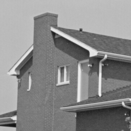
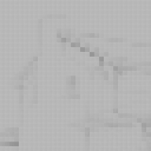

# 结果
| 原始图片 | 还原图片|
| ------------- | ------------- |
|  |  |

实际并没有完成图片还原，但好歹做都做了。
# 运行环境
- WSL
- OpenCV 4.7.0
- Eigen 3.4.0

# OMP算法

**输入** $M\ast N$的二维信号$Y$，$M\ast K$的字典矩阵$D$，稀疏度$k$.
**输出** $K\ast N$的稀疏矩阵$X$.

1. 初始化稀疏矩阵$X=0$，额外保存归一化的字典矩阵$D_{norm}$.
2. 对二维信号的每一列信号$y_i$循环3~8步骤.
3. 初始化残差$r=y_i$, 索引$I=\oslash$，迭代次数$t=1$.
4. 找到残差与归一化的字典矩阵的列$dn_j$内积最大值$j = argmax_{1,2...k}(r^T\cdot dn_j)$.
5. 更新索引$I=I\cup j$，重建原子集合$A_{new}=[D_{I\ne 0}]$.
6. 最小二乘法求解稀疏信号$x_i=argmin||y_i-A_{new}x_i||=(A_{new}^TA_{new})^{-1}A_{new}^Ty_i$
7. $t=t+1$
8. 如果$t<k$，循环4~7步骤，否则跳出循环.

# KSVD算法

**输入** $M*N$的二维信号$Y$，$M*K$的字典矩阵$D$，$K*N$的稀疏矩阵$X$，稀疏度$k$.
**输出** $M*K$的字典矩阵$D$，$K*N$的稀疏矩阵$X$.

1. 初始化字典矩阵$D$并使用$L_2$范数每列归一化.
2. 对二维信号$Y$通过[OMP算法](#omp算法)求解稀疏系数$X=argmin(Y-DX)$.
3. 对字典矩阵的每一列原子$d_j$，循环执行步骤4~6.
4. 找到原子$d_j$对应行稀疏系数非零项索引$w_j = \left\{i|1\le i\le N,x_j\ne 0\right\}$.
5. 按照稀疏系数非零项索引$w_j$构建新的稀疏系数$x_j'$和信号矩阵$y_j'$，并计算残差$E_k=y_j'-d_jx_j'$.
6. 对残差进行奇异值SVD分解$E_k=U\Delta V^T$，其中更新的原子$\tilde{d_j}=U(1,0)$，更新后的稀疏系数$\tilde{x_j'}=V(1,0)\Delta(1,1)$.

# 参考
## 库
- [kSVD-Image-Denoising](https://github.com/trungmanhhuynh/kSVD-Image-Denoising)
- [KSVD](https://github.com/DmytroBabenko/KSVD)

## 文献
- Aharon M, Elad M, Bruckstein A. K-SVD: An algorithm for designing overcomplete dictionaries for sparse representation[J]. IEEE Transactions on signal processing, 2006, 54(11): 4311-4322.
- Usman K. Introduction to orthogonal matching pursuit[J]. Telkom University, 2017.
- Rubinstein R, Zibulevsky M, Elad M. Efficient implementation of the K-SVD algorithm using batch orthogonal matching pursuit[R]. Computer Science Department, Technion, 2008.
- 赵海峰, 鲁毓苗, 陆明, 等. 基于快速稀疏表示的医学图像压缩[J]. 计算机工程, 2014, 40(4): 233-236.